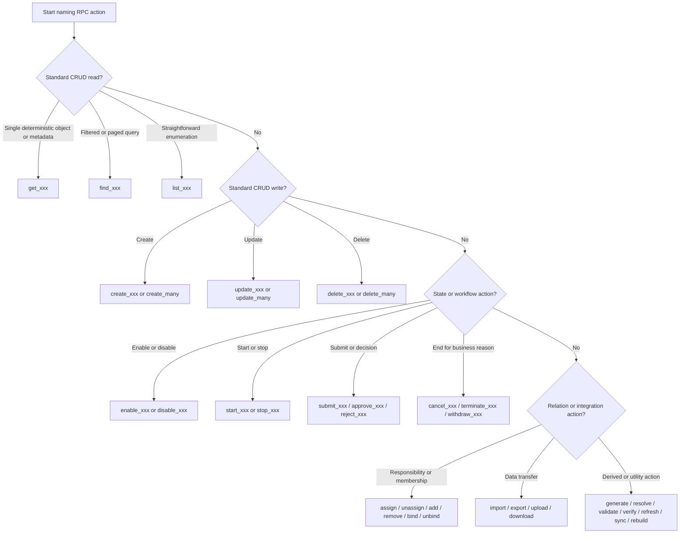

# Application Naming Conventions

This page defines the naming rules for VEF application code.

These rules combine:

- the framework's actual API naming validation rules
- the handler resolution rules used by `api` and `internal/api`
- standard Go naming practices for application code

### General Go Naming

| Scope | Rule | Examples |
| --- | --- | --- |
| Package names | Package names must be short, all-lowercase words. Mixed case and decorative separators must not be used. Singular names should be preferred by default | `approval`, `security`, `storage`, `user`, `model` |
| File names | File names must stay lowercase and responsibility-based. When multiple words are needed, use snake_case | `user_resource.go`, `user_service.go`, `user_loader.go` |
| Exported types | Exported type names must use PascalCase | `UserResource`, `UserService`, `LoginParams` |
| Unexported types | Unexported type names must use lowerCamelCase | `loginContext`, `routeEntry` |
| Exported functions and methods | Exported functions and methods must use PascalCase. Action-oriented names should start with a verb | `NewUserResource`, `CreateUser`, `FindPage` |
| Unexported functions and methods | Unexported functions and methods must use lowerCamelCase | `buildQuery`, `resolveHandler`, `parseRequest` |
| Interfaces | Interface names must express a capability or role. Prefer clear domain names or `-er` style when it reads naturally | `UserLoader`, `TokenGenerator`, `PermissionChecker` |
| Variables | Variable names must use lowerCamelCase. Very short names are only acceptable in tiny, obvious scopes | `userID`, `requestMeta`, `authManager` |
| Constants | Constants must follow normal Go identifier naming. For grouped constants, keep a consistent domain prefix when it improves clarity | `DefaultRPCEndpoint`, `AuthTypePassword`, `UserMenuTypeDirectory` |
| Struct fields | Struct fields must use PascalCase in Go code. External naming styles belong in tags, not in Go identifiers | `CreatedAt`, `UserID`, `PermTokens` |

Additional required guidance:

- package stutter must be avoided
  In package `approval`, prefer `Instance` or `FlowService` over names that redundantly repeat the package in every type
- package names should generally stay singular unless a plural form is semantically unavoidable
  Prefer `model`, `payload`, `resource`, `service`, `query`, `command` over `models`, `payloads`, `resources`, `services`, `queries`, `commands`
- common initialisms must keep normal Go form when that improves readability
  Examples: `ID`, `URL`, `HTTP`, `JSON`, `API`, `JWT`, `RPC`
- names must stay domain-oriented and stable
  Prefer `UserInfoLoader` over vague names such as `Loader2` or `DataHelper`

### API Resource And Action Naming

VEF enforces naming rules for resource names and action names. Violating these rules causes resource registration to fail.

#### RPC resource names

RPC resource names must:

- use slash-separated segments
- keep each segment lowercase
- use snake_case inside each segment when multiple words are needed
- avoid leading slash, trailing slash, and duplicate slashes

Valid examples:

- `user`
- `sys/user`
- `sys/data_dict`
- `approval/category`

Required convention:

- resource names should describe a business area or resource namespace
- use nouns or noun phrases for resources, not verbs

#### RPC action names

RPC action names must use `snake_case`.

Valid examples:

- `create`
- `find_page`
- `get_user_info`
- `resolve_challenge`

Required convention:

- action names should describe behavior, so verbs or verb phrases are preferred
- keep action names stable once they become part of a public API contract
- use `get_`, `find_`, `create_`, `update_`, `delete_`, `resolve_`, `list_` consistently instead of mixing synonyms without a reason

Verb selection rules:

| Verb or pattern | Use when | Typical scenarios | Examples | Do not use for |
| --- | --- | --- | --- | --- |
| `get_xxx` | The operation returns one deterministic object, one computed view, or one fixed piece of metadata | current user info, build info, schema detail, object metadata, detail by explicit key | `get_user_info`, `get_build_info`, `get_table_schema`, `get_presigned_url` | fuzzy search, paginated queries, bulk filtering |
| `find_xxx` | The operation performs query-style lookup driven by filters, search params, paging, or tree/options shaping | list pages, filtered lists, option lists, tree queries, single-record lookup under query semantics | `find_one`, `find_all`, `find_page`, `find_options`, `find_tree` | one fixed current-context object, imperative state transitions |
| `list_xxx` | The operation enumerates a straightforward collection without emphasizing search semantics | list tables, list views, list triggers, list files under a prefix | `list_tables`, `list_views`, `list_triggers`, `list_files` | complex filter queries better expressed as `find_xxx` |
| `create_xxx` | The operation creates one new business object | create user, create flow, create draft, create token record | `create_user`, `create_flow`, `create_draft` | updates to existing objects, upsert-like semantics |
| `create_many` or `create_xxx_batch` | The operation creates multiple records in one request | batch create employees, batch create tags, bulk initialization | `create_many`, `create_user_batch` | single-record create |
| `update_xxx` | The operation updates an existing object in place | edit profile, update flow config, update settings | `update_user`, `update_flow`, `update_settings` | partial state transitions that are semantically stronger verbs like approve, publish, enable |
| `update_many` or `update_xxx_batch` | The operation updates multiple existing records in one request | batch status adjustment, bulk tag update | `update_many`, `update_user_batch` | single-record update |
| `delete_xxx` | The operation removes one existing object | delete user, delete file metadata, delete draft | `delete_user`, `delete_draft` | soft business cancellation or workflow termination when a domain verb is clearer |
| `delete_many` or `delete_xxx_batch` | The operation removes multiple records in one request | bulk delete users, bulk cleanup | `delete_many`, `delete_user_batch` | single-record delete |
| `enable_xxx` / `disable_xxx` | The operation toggles a boolean-style availability or activation state | enable feature, disable account, disable integration | `enable_user`, `disable_feature` | long-running process lifecycle, publication lifecycle |
| `start_xxx` / `stop_xxx` | The operation starts or stops a running process, task, scheduler, or instance | start workflow instance, stop sync job, start replay | `start_instance`, `stop_job`, `start_replay` | simple boolean flag updates better expressed as enable/disable |
| `submit_xxx` | The operation submits a draft or request into the next processing stage | submit form, submit approval request, submit application | `submit_form`, `submit_instance` | creation itself when no stage transition is involved |
| `approve_xxx` / `reject_xxx` | The operation records an explicit business decision | approval workflow, review workflow, moderation | `approve_task`, `reject_task`, `approve_comment` | generic updates where no decision semantics exist |
| `cancel_xxx` / `terminate_xxx` / `withdraw_xxx` | The operation ends a business process for a specific domain reason | cancel order, terminate instance, withdraw application | `cancel_order`, `terminate_instance`, `withdraw_request` | physical deletion from storage or database |
| `assign_xxx` / `unassign_xxx` | The operation changes ownership or responsibility | assign task, unassign reviewer, assign department | `assign_task`, `unassign_reviewer` | generic relation edits that are not about responsibility |
| `add_xxx` / `remove_xxx` | The operation adds or removes members, children, attachments, or lightweight associations | add assignee, remove assignee, add cc, remove member | `add_assignee`, `remove_member`, `add_cc` | creation or deletion of the parent aggregate itself |
| `bind_xxx` / `unbind_xxx` | The operation creates or removes an explicit binding between two domains or external systems | bind role, unbind account, bind external app | `bind_role`, `unbind_account` | loose membership updates that are better expressed as add/remove |
| `publish_xxx` / `unpublish_xxx` | The operation changes external visibility or released state | publish version, unpublish article, publish template | `publish_version`, `unpublish_article` | internal activation flags without release semantics |
| `import_xxx` / `export_xxx` | The operation ingests or emits data in batch/file/report form | import users, export employees, export report | `import_user`, `export_employee`, `export_report` | ordinary create/list operations |
| `upload_xxx` / `download_xxx` | The operation transfers file content or binary artifacts | upload avatar, download attachment, upload object | `upload_avatar`, `download_attachment` | metadata lookup without file transfer |
| `generate_xxx` | The operation produces a server-generated artifact, token, code, preview, or URL | generate code, generate token, generate presigned URL | `generate_code`, `generate_token`, `generate_preview` | ordinary reads where the value already exists as stored state |
| `resolve_xxx` | The operation resolves a challenge, conflict, alias, or pending state into a concrete result | resolve challenge, resolve conflict, resolve dependency | `resolve_challenge`, `resolve_conflict` | ordinary updates where no resolution semantics exist |
| `validate_xxx` / `verify_xxx` | The operation checks validity or correctness without committing state changes | validate config, verify token, verify signature | `validate_config`, `verify_token` | actions that mutate state |
| `refresh_xxx` / `sync_xxx` / `rebuild_xxx` | The operation recomputes, synchronizes, or refreshes derived state from another source | refresh token, sync departments, rebuild index | `refresh`, `sync_department`, `rebuild_index` | first-time creation or ordinary read-only queries |

Preferred framework-aligned patterns:

- for standard CRUD-style reads, prefer the built-in `find_one`, `find_all`, `find_page`, `find_options`, `find_tree`, and `find_tree_options` vocabulary
- for standard CRUD-style writes, prefer `create`, `create_many`, `update`, `update_many`, `delete`, and `delete_many`
- do not mix near-synonyms such as `query_page`, `search_list`, `remove_user`, and `delete_user` inside the same bounded context unless the semantics are intentionally different

Common counterexamples:

| Incorrect name | Correct name | Why it is incorrect |
| --- | --- | --- |
| `GetUserInfo` | `get_user_info` | RPC action names must use `snake_case`, not PascalCase |
| `get-user-info` | `get_user_info` | RPC action names must not use kebab-case |
| `query_page` | `find_page` | Standard paginated query actions should align with built-in CRUD vocabulary |
| `search_list` | `find_all` or `find_page` | `search` and `list` are vague together; use the query shape that matches the real behavior |
| `remove_user` | `delete_user` | Do not mix near-synonyms for the same deletion semantics inside one bounded context |
| `get_user_list` | `find_all` or `find_page` | Collection queries should not be named as single-object `get_xxx` actions |
| `update_status` | `enable_xxx`, `disable_xxx`, `approve_xxx`, or `reject_xxx` when those are the real semantics | Generic `update` verbs are too weak when the business action is a specific state transition |
| `handle_task` | `approve_task`, `reject_task`, `assign_task`, or another explicit domain verb | `handle` does not communicate the actual business intent |
| `process_order` | `submit_order`, `cancel_order`, `complete_order`, or another explicit lifecycle verb | `process` is too broad to be a stable API action contract |
| `sync_data_and_rebuild_index` | split into `sync_data` and `rebuild_index`, or choose the single dominant action | One action name should express one primary responsibility |

### RPC Action Naming Decision Order

Use this decision order when naming a new RPC action:

1. Decide whether the action is a read, a write, a state transition, a relation change, or an integration/utility operation.
2. If it is a standard CRUD read or write, use the built-in CRUD vocabulary first instead of inventing a synonym.
3. If it is not standard CRUD, choose the narrowest verb that describes the business intent exactly.
4. If two verbs seem possible, prefer the one that better matches the observable outcome of the API contract.
5. If the action appears to contain multiple responsibilities, split the action or rename it around the dominant responsibility.

Mermaid decision flow:



#### RPC handler method names

When you do not specify `Handler` explicitly for an RPC operation, VEF resolves the handler method from the action name by converting it to PascalCase.

Examples:

- `find_page` -> `FindPage`
- `get_user_info` -> `GetUserInfo`
- `resolve_challenge` -> `ResolveChallenge`

That means:

- RPC action names should stay readable after PascalCase conversion
- handler method names should be PascalCase verbs or verb phrases

#### REST resource names

REST resource names must:

- use slash-separated segments
- keep each segment lowercase
- use kebab-case inside each segment when multiple words are needed

Valid examples:

- `users`
- `sys/user`
- `sys/data-dict`
- `user-profiles`

Required convention:

- let the resource path describe the collection or domain boundary
- let the HTTP method carry the main action semantics instead of putting verbs into the resource name

#### REST action names

REST action names must use one of these formats:

- `<method>`
- `<method> <sub-resource>`

Where:

- `<method>` is a lowercase HTTP verb such as `get`, `post`, `put`, `delete`, or `patch`
- `<sub-resource>` uses kebab-case

Valid examples:

- `get`
- `post`
- `delete`
- `get profile`
- `post admin`
- `get user-friends`

Required convention:

- keep the method token lowercase
- keep sub-resources noun-based and path-like
- do not use snake_case for REST sub-resources

#### API versions

Resource versions must follow the `v<number>` format.

Valid examples:

- `v1`
- `v2`
- `v10`

Versions should only be incremented when the external contract actually changes.

### Handler, Params, And Meta Types

Application-owned API types must use names that reflect their role in the request pipeline.

| Type kind | Recommended pattern | Examples |
| --- | --- | --- |
| Resource structs | `<Domain>Resource` | `UserResource`, `FlowResource` |
| Params structs | `<Action>Params` or `<Domain><Action>Params` | `LoginParams`, `CreateUserParams` |
| Meta structs | `<Domain>Meta` or `<Action>Meta` | `UserMeta`, `ExportMeta` |
| Search structs | `<Domain>Search` | `UserSearch`, `OrderSearch` |
| Service structs/interfaces | `<Domain>Service`, `<Capability>Loader`, `<Capability>Resolver` | `UserService`, `UserLoader`, `DepartmentResolver` |

Type names must remain specific enough to make sense when read from another package.

### Struct Fields, JSON, And Tags

VEF applications must keep these naming layers distinct:

- Go struct field names use PascalCase
- JSON field names use camelCase
- database columns use snake_case

Example:

```go
type User struct {
	ID        string `json:"id" bun:"id,pk"`
	UserName  string `json:"userName" bun:"user_name"`
	CreatedAt string `json:"createdAt" bun:"created_at"`
}
```

Each layer must keep its own naming style consistently. Mixing naming styles inside the same layer is not acceptable.

### Test Naming

Tests must follow the project testing naming rules:

| Element | Pattern | Examples |
| --- | --- | --- |
| Test suite | `<Feature>TestSuite` | `UserResourceTestSuite` |
| Test method | `Test<Feature>` | `TestLogin`, `TestFindPage` |
| Subtest name | PascalCase | `PasswordExpired`, `EmptyInput`, `InvalidToken` |

Sub-scenarios must not be encoded with underscores in top-level test method names.

Use:

- `TestLogin` with subtests such as `PasswordExpired`

Do not use:

- `TestLogin_PasswordExpired`

## See also

- [Database Naming Conventions](./database-naming-conventions) for schema-level naming rules
- [Routing](../guide/routing) for request identifier structure and endpoint exposure
- [Custom Handlers](../guide/custom-handlers) for RPC action to handler method resolution
- [Models](../guide/models) for field, JSON tag, and column naming interplay
