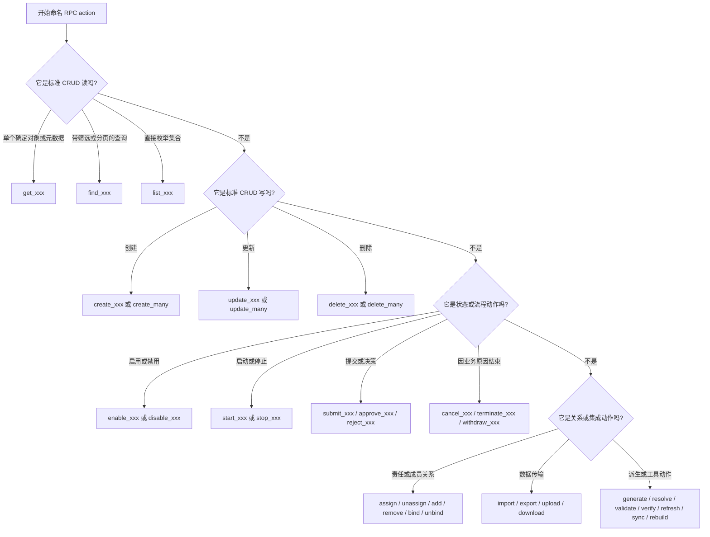

# 应用代码命名规范

本页定义 VEF 应用代码应遵循的命名规则。

这些规则综合了两部分来源：

- 框架本身真实存在的 API 命名校验规则
- `api` 与 `internal/api` 中使用的 handler 解析规则，以及 Go 社区通用命名最佳实践

### Go 通用命名

| 范围 | 规则 | 示例 |
| --- | --- | --- |
| package 名 | package 名必须简短且全小写。不得使用混合大小写和装饰性分隔符。默认应优先使用单数形式 | `approval`、`security`、`storage`、`user`、`model` |
| 文件名 | 文件名必须全小写并按职责命名。多个单词时使用 snake_case | `user_resource.go`、`user_service.go`、`user_loader.go` |
| 导出类型 | 导出类型名必须使用 PascalCase | `UserResource`、`UserService`、`LoginParams` |
| 非导出类型 | 非导出类型名必须使用 lowerCamelCase | `loginContext`、`routeEntry` |
| 导出函数和方法 | 导出函数和方法必须使用 PascalCase；执行动作的名字应当用动词开头 | `NewUserResource`、`CreateUser`、`FindPage` |
| 非导出函数和方法 | 非导出函数和方法必须使用 lowerCamelCase | `buildQuery`、`resolveHandler`、`parseRequest` |
| 接口 | 接口名必须表达能力或职责。能自然读通时优先使用领域名词或 `-er` 风格 | `UserLoader`、`TokenGenerator`、`PermissionChecker` |
| 变量 | 变量名必须使用 lowerCamelCase。只有在作用域极小且语义非常明显时才允许很短的名字 | `userID`、`requestMeta`、`authManager` |
| 常量 | 常量必须遵循 Go 风格命名。成组常量在有助于理解时保持统一领域前缀 | `DefaultRPCEndpoint`、`AuthTypePassword`、`UserMenuTypeDirectory` |
| 结构体字段 | 结构体字段在 Go 代码中必须使用 PascalCase。外部命名风格应通过 tag 映射 | `CreatedAt`、`UserID`、`PermTokens` |

补充要求：

- 必须避免 package stutter，也就是类型名无意义地重复包名
  例如在 `approval` 包里，应优先使用 `Instance` 或 `FlowService`，而不是所有类型都重复写一遍 `Approval`
- package 名通常应保持单数，除非复数形式在语义上不可避免
  优先使用 `model`、`payload`、`resource`、`service`、`query`、`command`，而不是 `models`、`payloads`、`resources`、`services`、`queries`、`commands`
- 常见缩写在可读性更好的前提下，必须保持正常 Go 写法
  例如：`ID`、`URL`、`HTTP`、`JSON`、`API`、`JWT`、`RPC`
- 命名必须稳定且面向领域
  应优先使用 `UserInfoLoader` 这类有职责含义的名字，不得使用 `Loader2`、`DataHelper` 这类模糊名称

### API Resource 与 Action 命名

VEF 会对 resource name 和 action name 做校验。这不只是风格建议，命名不合法时资源注册会直接失败。

#### RPC resource name

RPC 资源名必须满足：

- 使用斜杠分段
- 每个分段都使用小写
- 分段内部如果有多个单词，使用 snake_case
- 不能有前导 `/`、尾随 `/`，也不能出现连续的 `//`

合法示例：

- `user`
- `sys/user`
- `sys/data_dict`
- `approval/category`

强制约定：

- resource name 应表达业务边界或资源命名空间
- resource name 应使用名词或名词短语，而不是动词

#### RPC action name

RPC action name 必须使用 `snake_case`。

合法示例：

- `create`
- `find_page`
- `get_user_info`
- `resolve_challenge`

强制约定：

- action name 应表达行为，因此优先使用动词或动词短语
- 一旦对外暴露为 API 合同后，action name 应尽量保持稳定
- `get_`、`find_`、`create_`、`update_`、`delete_`、`resolve_`、`list_` 这类前缀风格应保持一致，不要无故混用同义词

动词选用规则：

| 动词或模式 | 适用场景 | 常见业务语义 | 示例 | 不适合用于 |
| --- | --- | --- | --- | --- |
| `get_xxx` | 返回单个确定对象、单个计算结果，或固定元数据 | 当前用户信息、构建信息、Schema 明细、对象元数据、按明确主键取详情 | `get_user_info`、`get_build_info`、`get_table_schema`、`get_presigned_url` | 模糊搜索、分页查询、批量过滤 |
| `find_xxx` | 带筛选、搜索、分页、树形/选项整形语义的查询 | 列表分页、条件过滤、选项列表、树查询、按查询语义取单条 | `find_one`、`find_all`、`find_page`、`find_options`、`find_tree` | 固定上下文下的单个对象读取，或命令式状态变更 |
| `list_xxx` | 直接枚举一个相对简单的集合，不强调复杂查询语义 | 列表出表、视图、触发器、某个前缀下的文件 | `list_tables`、`list_views`、`list_triggers`、`list_files` | 更适合表述为检索/筛选的复杂查询 |
| `create_xxx` | 创建一个新的业务对象 | 创建用户、创建流程、创建草稿、创建令牌记录 | `create_user`、`create_flow`、`create_draft` | 更新已有对象，或带 upsert 含义的动作 |
| `create_many` 或 `create_xxx_batch` | 一次创建多条记录 | 批量创建员工、批量创建标签、批量初始化 | `create_many`、`create_user_batch` | 单条创建 |
| `update_xxx` | 原地更新已有对象 | 修改资料、更新流程配置、更新设置 | `update_user`、`update_flow`、`update_settings` | 审批、发布、启停等语义更强的状态动作 |
| `update_many` 或 `update_xxx_batch` | 一次更新多条已有记录 | 批量调整状态、批量更新标签 | `update_many`、`update_user_batch` | 单条更新 |
| `delete_xxx` | 删除一个已有对象 | 删除用户、删除草稿、删除文件记录 | `delete_user`、`delete_draft` | 更适合用 cancel / terminate / withdraw 表达的业务结束动作 |
| `delete_many` 或 `delete_xxx_batch` | 一次删除多条记录 | 批量删除用户、批量清理记录 | `delete_many`、`delete_user_batch` | 单条删除 |
| `enable_xxx` / `disable_xxx` | 切换布尔型启用状态 | 启用功能、禁用账号、禁用集成 | `enable_user`、`disable_feature` | 长流程启停或发布生命周期 |
| `start_xxx` / `stop_xxx` | 启动或停止一个运行中的流程、任务、调度器、实例 | 启动流程实例、停止同步任务、开始重放 | `start_instance`、`stop_job`、`start_replay` | 仅仅修改启用开关的场景 |
| `submit_xxx` | 把草稿或请求推进到下一处理阶段 | 提交表单、提交审批单、提交申请 | `submit_form`、`submit_instance` | 单纯创建数据但没有阶段推进 |
| `approve_xxx` / `reject_xxx` | 记录一个明确的业务决策 | 审批流、审核流、内容审核 | `approve_task`、`reject_task`、`approve_comment` | 不带决策语义的普通更新 |
| `cancel_xxx` / `terminate_xxx` / `withdraw_xxx` | 以特定业务原因结束流程 | 取消订单、终止实例、撤回申请 | `cancel_order`、`terminate_instance`、`withdraw_request` | 物理删除数据库或存储对象 |
| `assign_xxx` / `unassign_xxx` | 改变负责人、归属人、处理人 | 分派任务、取消分派审核人、指定部门 | `assign_task`、`unassign_reviewer` | 普通关联关系编辑但不涉及责任归属 |
| `add_xxx` / `remove_xxx` | 增减成员、附件、子项、轻量关系 | 添加 assignee、移除 assignee、增加抄送、移除成员 | `add_assignee`、`remove_member`、`add_cc` | 父对象本身的创建或删除 |
| `bind_xxx` / `unbind_xxx` | 建立或解除明确绑定关系 | 绑定角色、解绑账号、绑定外部应用 | `bind_role`、`unbind_account` | 更适合用 add/remove 表达的松散成员关系 |
| `publish_xxx` / `unpublish_xxx` | 改变外部可见性或发布状态 | 发布版本、下线文章、发布模板 | `publish_version`、`unpublish_article` | 只是内部启用/禁用的状态变更 |
| `import_xxx` / `export_xxx` | 进行数据导入导出、批量导入、报表导出 | 导入用户、导出员工、导出报表 | `import_user`、`export_employee`、`export_report` | 普通 create/list 动作 |
| `upload_xxx` / `download_xxx` | 传输文件内容或二进制产物 | 上传头像、下载附件、上传对象 | `upload_avatar`、`download_attachment` | 仅查询文件元数据而不传输内容 |
| `generate_xxx` | 由服务端生成一个产物、令牌、编码、预览或 URL | 生成编码、生成令牌、生成预签名地址 | `generate_code`、`generate_token`、`generate_preview` | 读取一个本来就已经存在的持久化值 |
| `resolve_xxx` | 把 challenge、冲突、别名、待定状态解析成确定结果 | 解析挑战、解决冲突、解析依赖 | `resolve_challenge`、`resolve_conflict` | 普通更新但没有“解析/消解”语义 |
| `validate_xxx` / `verify_xxx` | 校验正确性，但不提交状态变更 | 校验配置、校验令牌、校验签名 | `validate_config`、`verify_token` | 会修改状态的动作 |
| `refresh_xxx` / `sync_xxx` / `rebuild_xxx` | 重新计算、同步、刷新派生状态 | 刷新 token、同步部门、重建索引 | `refresh`、`sync_department`、`rebuild_index` | 首次创建对象，或普通只读查询 |

优先使用的框架对齐模式：

- 标准 CRUD 读操作优先使用内置词汇：`find_one`、`find_all`、`find_page`、`find_options`、`find_tree`、`find_tree_options`
- 标准 CRUD 写操作优先使用内置词汇：`create`、`create_many`、`update`、`update_many`、`delete`、`delete_many`
- 除非语义明确不同，否则不要在同一个 bounded context 内混用近义词，例如 `query_page`、`search_list`、`remove_user`、`delete_user`

常见反例：

| 错误写法 | 正确写法 | 错误原因 |
| --- | --- | --- |
| `GetUserInfo` | `get_user_info` | RPC action name 必须使用 `snake_case`，不能用 PascalCase |
| `get-user-info` | `get_user_info` | RPC action name 不能使用 kebab-case |
| `query_page` | `find_page` | 标准分页查询应优先对齐内置 CRUD 词汇 |
| `search_list` | `find_all` 或 `find_page` | `search` 和 `list` 组合语义过泛，应改成能直接表达查询形态的命名 |
| `remove_user` | `delete_user` | 同一 bounded context 内不要为同一删除语义混用近义词 |
| `get_user_list` | `find_all` 或 `find_page` | 集合查询不应使用单对象语义的 `get_xxx` |
| `update_status` | 在真实语义明确时改为 `enable_xxx`、`disable_xxx`、`approve_xxx` 或 `reject_xxx` | 当业务动作是明确状态迁移时，泛化的 `update` 语义太弱 |
| `handle_task` | `approve_task`、`reject_task`、`assign_task` 或其他明确领域动词 | `handle` 无法表达真实业务意图 |
| `process_order` | `submit_order`、`cancel_order`、`complete_order` 或其他明确生命周期动词 | `process` 过于宽泛，不适合作为稳定 API 合同 |
| `sync_data_and_rebuild_index` | 拆成 `sync_data` 和 `rebuild_index`，或者只保留主职责动作名 | 一个 action name 应只表达一个主要职责 |

### RPC Action 命名决策顺序

为新的 RPC action 命名时，应按下面的顺序判断：

1. 先判断它属于读、写、状态迁移、关系变更，还是集成/工具类动作。
2. 如果它本质上是标准 CRUD 读写，优先使用框架现有 CRUD 词汇，不要新造近义词。
3. 如果它不是标准 CRUD，选择最能准确表达业务意图的最窄动词。
4. 如果两个动词都看起来能用，优先选择更能反映 API 最终可观察结果的那个。
5. 如果一个 action 看起来同时承担多个职责，应拆分动作，或者按主职责重命名。

Mermaid 决策图：



#### RPC handler 方法名

对于 RPC 资源，如果没有显式指定 `Handler`，VEF 会把 action name 转成 PascalCase 后去查找对应方法。

例如：

- `find_page` -> `FindPage`
- `get_user_info` -> `GetUserInfo`
- `resolve_challenge` -> `ResolveChallenge`

这意味着：

- RPC action name 在转成 PascalCase 后也要保持可读
- handler 方法名应使用 PascalCase 的动词或动词短语

#### REST resource name

REST 资源名必须满足：

- 使用斜杠分段
- 每个分段都使用小写
- 分段内部如果有多个单词，使用 kebab-case

合法示例：

- `users`
- `sys/user`
- `sys/data-dict`
- `user-profiles`

强制约定：

- 让资源路径表达集合或领域边界
- 让 HTTP method 承担主要动作语义，而不是把动词塞进 resource name

#### REST action name

REST action name 必须使用以下两种格式之一：

- `<method>`
- `<method> <sub-resource>`

其中：

- `<method>` 是小写 HTTP verb，例如 `get`、`post`、`put`、`delete`、`patch`
- `<sub-resource>` 使用 kebab-case

合法示例：

- `get`
- `post`
- `delete`
- `get profile`
- `post admin`
- `get user-friends`

强制约定：

- method token 保持小写
- sub-resource 使用名词化、路径化命名
- REST sub-resource 不要使用 snake_case

#### API 版本号

资源版本号必须满足 `v<number>` 格式。

合法示例：

- `v1`
- `v2`
- `v10`

只有外部接口契约发生真实变化时，才应当递增版本号。

### Handler、Params 与 Meta 类型命名

对于应用自定义的 API 类型，名称必须直接表达它在请求链路中的角色。

| 类型类别 | 推荐模式 | 示例 |
| --- | --- | --- |
| Resource 结构体 | `<Domain>Resource` | `UserResource`、`FlowResource` |
| Params 结构体 | `<Action>Params` 或 `<Domain><Action>Params` | `LoginParams`、`CreateUserParams` |
| Meta 结构体 | `<Domain>Meta` 或 `<Action>Meta` | `UserMeta`、`ExportMeta` |
| Search 结构体 | `<Domain>Search` | `UserSearch`、`OrderSearch` |
| Service 结构体/接口 | `<Domain>Service`、`<Capability>Loader`、`<Capability>Resolver` | `UserService`、`UserLoader`、`DepartmentResolver` |

类型名必须足够具体，保证放到其他 package 里阅读时仍然自解释。

### 结构体字段、JSON 与标签命名

VEF 应用必须保持这组分层命名约定：

- Go 结构体字段名使用 PascalCase
- JSON 字段名使用 camelCase
- 数据库列名使用 snake_case

示例：

```go
type User struct {
	ID        string `json:"id" bun:"id,pk"`
	UserName  string `json:"userName" bun:"user_name"`
	CreatedAt string `json:"createdAt" bun:"created_at"`
}
```

每一层都必须保持自己的命名风格一致，不得在同一层里混用多种风格。

### 测试命名

测试命名必须遵循项目测试规范：

| 元素 | 模式 | 示例 |
| --- | --- | --- |
| 测试套件 | `<Feature>TestSuite` | `UserResourceTestSuite` |
| 测试方法 | `Test<Feature>` | `TestLogin`、`TestFindPage` |
| 子测试名 | PascalCase | `PasswordExpired`、`EmptyInput`、`InvalidToken` |

不得在顶层测试方法名中用下划线编码子场景。

应当使用：

- `TestLogin`，下面用 `PasswordExpired` 之类的子测试

不得写成：

- `TestLogin_PasswordExpired`

## 延伸阅读

- [数据库命名规范](./database-naming-conventions)：schema 层命名规则
- [路由](../guide/routing)：请求标识结构与路由暴露方式
- [自定义处理器](../guide/custom-handlers)：RPC action 到 handler 方法的解析规则
- [模型](../guide/models)：字段名、JSON tag 与列名之间的配合方式
